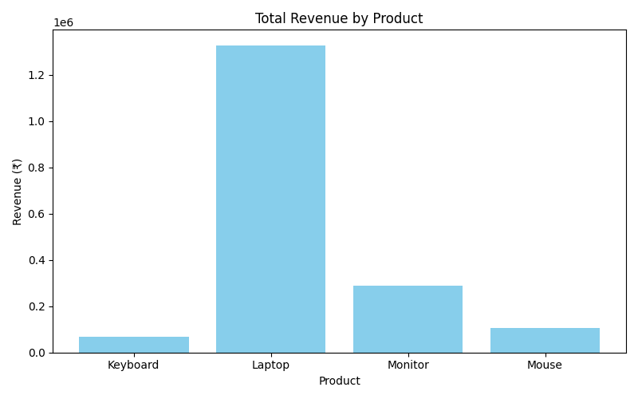

# Basic Sales Summary using SQLite and Python

This project demonstrates how to generate a simple sales summary using Python and SQLite.  
It calculates total quantity sold and total revenue for each product, and visualizes the results using a bar chart.

---

## Project Overview

**Objective:**  
To extract and analyze sales data using SQL queries inside Python and display insights through simple print outputs and a bar chart.

**Tools Used:**  
- Python  
- SQLite (built-in)  
- pandas  
- matplotlib  

---

## How It Works

1. Connects to the local SQLite database.  
2. Ensures that the **sales** table exists and inserts sample data.  
3. Runs SQL queries to calculate total quantity and revenue for each product.  
4. Displays the summarized data in the terminal.  
5. Plots a simple bar chart showing total revenue per product.  

---

